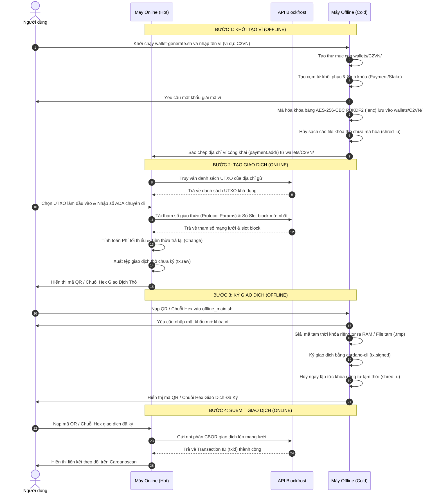

# Quy Trình Giao Dịch & Cơ Chế Bảo Mật Ví Cardano Air-Gap

Tài liệu này mô tả chi tiết quy trình luân chuyển dữ liệu giao dịch từ khâu khởi tạo trực tuyến, ký ngoại tuyến đến gửi lên mạng lưới (Submit), đồng thời giải thích phương thức bảo mật mã hóa khóa riêng tư (Private Key) và cụm từ khôi phục (Seed Phrase).

---

## 1. Biểu Đồ Luồng Hoạt Động (Transaction Workflow)

Dưới đây là sơ đồ Mermaid mô tả trực quan các bước chuyển giao dữ liệu giữa hai môi trường trực tuyến và ngoại tuyến:

---

## 2. Quy Trình Giao Dịch Chi Tiết

### Khởi tạo Giao dịch (Online)
1.  **Truy vấn thông tin**: Máy Online sử dụng API Blockfrost lấy danh sách UTXO khả dụng của địa chỉ ví, tham số giao thức mạng (cho việc tính phí) và số slot hiện tại (để thiết lập thời hạn kết thúc TTL).
2.  **Tính toán mức phí & Tiền thừa**:
    *   Hệ thống dựng giao dịch nháp (draft) với phí = 0.
    *   Sử dụng `cardano-cli conway transaction calculate-min-fee` để tính phí thực tế.
    *   Tính toán tiền thừa trả về (Change). Nếu số dư thừa nhỏ hơn mức tối thiểu (1 ADA), hệ thống sẽ cảnh báo bụi giao dịch (dust) và hỏi người dùng có muốn cộng gộp số dư thừa đó vào phí giao dịch hay không nhằm đảm bảo giao dịch hợp lệ.
3.  **Xuất dữ liệu**: Xuất tệp `tx.raw` và tạo ra mã QR chứa tiền tố nhận diện `TxBodyConway:<chuỗi_hex_CBOR_giao_dịch_thô>`.

### Ký Giao dịch (Offline)
1.  **Tiếp nhận giao dịch**: Máy Offline tiếp nhận dữ liệu thông qua việc quét mã QR bằng webcam, đọc từ file hình ảnh hoặc dán chuỗi hex bằng tay.
2.  **Nhập mật khẩu**: Người dùng cung cấp mật khẩu để giải mã các tệp khóa bảo mật.
3.  **Ký cục bộ**: Sử dụng `cardano-cli conway transaction sign` để ký giao dịch ngoại tuyến hoàn toàn, không cần kết nối mạng.
4.  **Xuất kết quả đã ký**: Xuất ra mã QR và chuỗi văn bản với tiền tố `TxConway:<chuỗi_hex_CBOR_đã_ký>`.

### Submit Giao dịch (Online)
1.  **Nạp giao dịch đã ký**: Máy Online nhận mã QR / Chuỗi Hex đã ký từ máy Offline.
2.  **Submit lên mạng**: Hàm `bf_submit_tx` chuyển đổi chuỗi Hex thành nhị phân CBOR thô và gửi lên Blockfrost thông qua phương thức `POST` tới endpoint `/tx/submit` với header `Content-Type: application/cbor`.
3.  **Xác nhận**: Trả về mã băm giao dịch (TxID) và kết xuất link theo dõi.

---

## 3. Cơ Chế Bảo Mật & Bảo Vệ Seed/Private Key

Bảo mật khóa riêng tư và cụm từ khôi phục (Seed Phrase) là yếu tố sống còn đối với ví ngoại tuyến. Hệ thống thực thi các giải pháp bảo mật sau:

### A. Mã Hóa Chuẩn Quân Sự (Military-Grade Encryption)
Hệ thống sử dụng mật khẩu của người dùng kết hợp công nghệ mật mã của OpenSSL:
*   **Thuật toán mã hóa**: `AES-256-CBC` (Advanced Encryption Standard 256-bit trong chế độ Cipher Block Chaining). Đây là chuẩn mã hóa đối xứng mạnh nhất được khuyến nghị.
*   **Hàm tạo khóa (KDF)**: Sử dụng `PBKDF2` (Password-Based Key Derivation Function 2) cùng thuật toán băm bảo mật cao để chống lại các cuộc tấn công dò mật khẩu (brute-force).
*   **Số vòng lặp băm (Iterations)**: Thiết lập tối thiểu `100,000` vòng lặp nhằm làm chậm tốc độ dò mật khẩu của các phần cứng chuyên dụng (GPU/ASIC).
*   **Mã hóa salt**: Bổ sung cờ `-salt` để tạo ra chuỗi khóa ngẫu nhiên khác nhau cho mỗi lần mã hóa, chống tấn công bảng băm (rainbow table).

### B. Cơ Chế Giải Mã & Khởi Tạo Trên RAM (RAM-disk Isolation)
*   Khóa riêng tư và cụm từ phục hồi thô (chưa mã hóa) chỉ tồn tại dưới dạng thô trong một khoảng thời gian cực ngắn khi thực hiện tác vụ sinh khóa hoặc ký giao dịch.
*   **Không ghi đĩa cứng**: Tất cả các tệp thô tạm thời này được lưu trữ trực tiếp trong thư mục con của `/dev/shm` (được gắn dưới dạng **tmpfs** - hệ thống tệp chỉ chạy trên bộ nhớ RAM). Vì dữ liệu chỉ được ghi lên các ô nhớ volatile RAM, nó hoàn toàn không chạm vào các cung từ (sectors) hay tế bào nhớ flash của ổ đĩa cứng vật lý (HDD/SSD).
*   Nếu hệ thống không hỗ trợ `/dev/shm` (không ghi được RAM disk), mã nguồn sẽ tự động phát hiện và chuyển đổi dự phòng an toàn sang tạo thư mục tạm trong ổ đĩa hiện tại.

### C. Hủy Sạch Dấu Vết Dữ Liệu (Secure Shredding)
Khi xóa các tệp nhạy cảm (sau khi tạo khóa hoặc ký xong giao dịch), các lệnh xóa thông thường (như `rm`) chỉ gỡ liên kết trỏ tới tệp chứ không xóa dữ liệu vật lý. Để đảm bảo an toàn tuyệt đối, hệ thống thực hiện:
*   Sử dụng lệnh **`shred -u`**: Tiến hành ghi đè dữ liệu rác ngẫu nhiên đè lên vùng nhớ chứa khóa nhiều lần trước khi xóa bỏ liên kết tệp. Việc này được thực hiện trên RAM (hoặc ổ cứng dự phòng) để xóa sạch mọi vết tích nhị phân.
*   Bảo vệ an toàn bằng cấu trúc `trap` trong Bash để tự động kích hoạt hàm dọn dẹp và hủy khóa thô ngay cả khi người dùng đột ngột tắt script hoặc chương trình gặp sự cố (Crash) bất ngờ.

---

## 4. Tóm Tắt Tệp Tin Bảo Mật Trên Máy Offline (nằm trong wallets/<WALLET_NAME>/)

*   **`payment.addr`**: Địa chỉ ví thanh toán công khai (An toàn để chia sẻ).
*   **`payment.skey.enc`**: Khóa riêng tư thanh toán đã mã hóa (Không được để lộ, cần mật khẩu để mở).
*   **`stake.skey.enc`**: Khóa riêng tư ủy quyền đã mã hóa (Không được để lộ, cần mật khẩu để mở).
*   **`phrase.prv.enc`**: Cụm 24 từ khôi phục đã mã hóa (Cực kỳ quan trọng, cần sao lưu an toàn ở nhiều nơi vật lý khác nhau).
