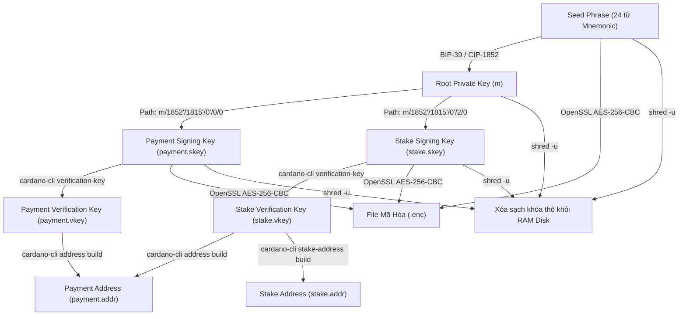

# Hướng Dẫn Chi Tiết Quy Trình Tạo Ví Cardano Từ Seed Phrase Đến Địa Chỉ Ví (`.addr`)

Tài liệu này hướng dẫn chi tiết từng bước (step-by-step) quá trình tạo một ví Cardano Shelley chuẩn (CIP-1852 / CIP-113) hoàn chỉnh, từ việc sinh cụm từ khôi phục bảo mật (Seed Phrase / Mnemonic 24 từ), dẫn xuất các khóa riêng tư (Private Keys), khóa công khai (Public Verification Keys) cho tới việc tạo địa chỉ ví nhận tiền (`payment.addr`) và địa chỉ ủy quyền (`stake.addr`).

---

## 1. Sơ Đồ Quy Trình Dẫn Xuất Khóa & Địa Chỉ (Derivation Flow)

Theo tiêu chuẩn **CIP-1852** của Cardano, cấu trúc phân cấp ví (HD Wallet) tuân theo đường dẫn:
`m / 1852' / 1815' / account' / role / index`

* **`1852'`**: Mã mục đích (Purpose code dành cho ví Shelley).
* **`1815'`**: Mã đồng tiền Cardano ADA (Coin type theo chuẩn SLIP-0044).
* **`account'`**: Số thứ tự tài khoản (mặc định tài khoản đầu tiên là `0'`).
* **`role`**: Vai trò của khóa (`0`: Payment Key, `1`: Change Key, `2`: Stake Key).
* **`index`**: Chỉ số của khóa (mặc định khóa đầu tiên là `0`).



---

## 2. Các Bước Thực Hiện Chi Tiết (Thao Tác Bằng Lệnh Bash)

Bạn có thể thực hiện theo 1 trong 2 cách bên dưới tùy thuộc vào công cụ có sẵn trên máy ngoại tuyến (Offline Machine):
- **Phương pháp 1**: Kết hợp `cardano-address` và `cardano-cli` (Chuẩn CIP-1852 truyền thống).
- **Phương pháp 2**: Sử dụng trực tiếp `cardano-cli` (Hỗ trợ từ phiên bản Cardano CLI Conway).

---

### PHƯƠNG PHÁP 1: Dùng `cardano-address` & `cardano-cli`

#### Bước 1: Sinh Cụm Từ Khôi Phục (Seed Phrase - 24 Từ BIP-39)
Tạo 24 từ ngẫu nhiên lưu trực tiếp vào thư mục tạm an toàn trong bộ nhớ RAM (`/dev/shm`):

```bash
cardano-address recovery-phrase generate --size 24 > /dev/shm/phrase.prv
```

#### Bước 2: Sinh Khóa Gốc (Root Master Private Key)
Tạo khóa gốc master private key (`root.prv`) từ 24 từ khôi phục:

```bash
cardano-address key from-recovery-phrase Shelley < /dev/shm/phrase.prv > /dev/shm/root.prv
```

#### Bước 3: Dẫn Xuất Khóa Thanh Toán (Payment Key)
- Đường dẫn derivation path: `1852H/1815H/0H/0/0` (viết tắt H thay cho dấu `'` đại diện cho Hardened Key Derivation).

```bash
# 1. Sinh khóa thanh toán riêng tư thô
cardano-address key child 1852H/1815H/0H/0/0 < /dev/shm/root.prv > /dev/shm/payment.prv

# 2. Xuất khóa thanh toán công khai thô
cardano-address key public --without-chain-code < /dev/shm/payment.prv > wallets/C2VN/payment.pub

# 3. Chuyển đổi khóa riêng tư sang định dạng skey tương thích cardano-cli
cardano-cli key convert-cardano-address-key \
    --shelley-payment-key \
    --signing-key-file /dev/shm/payment.prv \
    --out-file /dev/shm/payment.skey

# 4. Xuất khóa xác minh công khai (Verification Key - vkey)
cardano-cli key verification-key \
    --signing-key-file /dev/shm/payment.skey \
    --verification-key-file wallets/C2VN/payment.vkey
```

#### Bước 4: Dẫn Xuất Khóa Ủy Quyền Stake (Stake Key)
- Đường dẫn derivation path: `1852H/1815H/0H/2/0`.

```bash
# 1. Sinh khóa stake riêng tư thô
cardano-address key child 1852H/1815H/0H/2/0 < /dev/shm/root.prv > /dev/shm/stake.prv

# 2. Chuyển đổi khóa stake sang định dạng skey của cardano-cli
cardano-cli key convert-cardano-address-key \
    --shelley-stake-key \
    --signing-key-file /dev/shm/stake.prv \
    --out-file /dev/shm/stake.skey

# 3. Xuất khóa stake công khai mở rộng (Extended Stake vkey)
cardano-cli key verification-key \
    --signing-key-file /dev/shm/stake.skey \
    --verification-key-file /dev/shm/Ext_ShelleyStake.vkey

# 4. Chuẩn hóa về dạng khóa stake công khai tiêu chuẩn (Non-extended Stake vkey)
cardano-cli key non-extended-key \
    --extended-verification-key-file /dev/shm/Ext_ShelleyStake.vkey \
    --verification-key-file wallets/C2VN/stake.vkey
```

---

### PHƯƠNG PHÁP 2: Sử Dụng Trực Tiếp `cardano-cli` (Conway Era)

Nếu hệ thống không có `cardano-address`, bạn có thể thực hiện toàn bộ quy trình sinh khóa chỉ với `cardano-cli`:

#### Bước 1: Sinh Mnemonic 24 Từ
```bash
cardano-cli key generate-mnemonic --size 24 --out-file /dev/shm/phrase.prv
```

#### Bước 2: Dẫn Xuất Khóa Thanh Toán (Payment Key)
```bash
# Dẫn xuất trực tiếp payment.skey từ file mnemonic với account=0, payment=0
cardano-cli key derive-from-mnemonic \
    --mnemonic-from-file /dev/shm/phrase.prv \
    --account-number 0 \
    --payment-key-with-number 0 \
    --signing-key-file /dev/shm/payment.skey

# Xuất khóa verification key công khai
cardano-cli key verification-key \
    --signing-key-file /dev/shm/payment.skey \
    --verification-key-file wallets/C2VN/payment.vkey
```

#### Bước 3: Dẫn Xuất Khóa Stake (Stake Key)
```bash
# Dẫn xuất trực tiếp stake.skey từ file mnemonic với account=0, stake=0
cardano-cli key derive-from-mnemonic \
    --mnemonic-from-file /dev/shm/phrase.prv \
    --account-number 0 \
    --stake-key-with-number 0 \
    --signing-key-file /dev/shm/stake.skey

# Xuất khóa verification key công khai
cardano-cli key verification-key \
    --signing-key-file /dev/shm/stake.skey \
    --verification-key-file /dev/shm/Ext_ShelleyStake.vkey

# Chuẩn hóa về non-extended stake vkey
cardano-cli key non-extended-key \
    --extended-verification-key-file /dev/shm/Ext_ShelleyStake.vkey \
    --verification-key-file wallets/C2VN/stake.vkey
```

---

## 3. Tạo Địa Chỉ Ví (`payment.addr` & `stake.addr`)

Sau khi có `payment.vkey` và `stake.vkey`, bước tiếp theo là xây dựng địa chỉ ví Cardano.

#### 3.1. Địa chỉ nhận tiền (`payment.addr`)
Địa chỉ Shelley chuẩn được tạo bằng cách kết hợp Payment Verification Key và Stake Verification Key:

* **Mạng Preprod Testnet** (Sử dụng `--testnet-magic 2`):
  ```bash
  cardano-cli address build \
      --payment-verification-key-file wallets/C2VN/payment.vkey \
      --stake-verification-key-file wallets/C2VN/stake.vkey \
      --testnet-magic 2 \
      --out-file wallets/C2VN/payment.addr
  ```

* **Mạng Mainnet** (Sử dụng `--mainnet`):
  ```bash
  cardano-cli address build \
      --payment-verification-key-file wallets/C2VN/payment.vkey \
      --stake-verification-key-file wallets/C2VN/stake.vkey \
      --mainnet \
      --out-file wallets/C2VN/payment.addr
  ```

> Kết quả địa chỉ: `addr_test1...` (Preprod) hoặc `addr1...` (Mainnet).

#### 3.2. Địa chỉ ủy quyền Stake (`stake.addr`)
Dùng để ủy quyền nhận phần thưởng staking:

```bash
cardano-cli conway stake-address build \
    --stake-verification-key-file wallets/C2VN/stake.vkey \
    --testnet-magic 2 \
    --out-file wallets/C2VN/stake.addr
```

> Kết quả địa chỉ stake: `stake_test1...` (Preprod) hoặc `stake1...` (Mainnet).

---

## 4. Bảo Mật Khóa Riêng Tư & Dọn Dẹp Bộ Nhớ RAM

Để tuân thủ tiêu chuẩn an toàn **Air-Gap (Cold Wallet)**, các khóa riêng tư không được lưu trữ ở dạng văn bản thuần trên ổ cứng.

#### Bước 1: Mã Hóa Khóa Bằng OpenSSL (AES-256-CBC PBKDF2)
Mã hóa 3 tệp nhạy cảm (`payment.skey`, `stake.skey`, `phrase.prv`) bằng mật khẩu người dùng chọn với **100,000 vòng lặp PBKDF2**:

```bash
openssl enc -aes-256-cbc -salt -pbkdf2 -iter 100000 \
    -in /dev/shm/payment.skey \
    -out wallets/C2VN/payment.skey.enc \
    -pass pass:"MAT_KHAU_CUA_BAN"

openssl enc -aes-256-cbc -salt -pbkdf2 -iter 100000 \
    -in /dev/shm/stake.skey \
    -out wallets/C2VN/stake.skey.enc \
    -pass pass:"MAT_KHAU_CUA_BAN"

openssl enc -aes-256-cbc -salt -pbkdf2 -iter 100000 \
    -in /dev/shm/phrase.prv \
    -out wallets/C2VN/phrase.prv.enc \
    -pass pass:"MAT_KHAU_CUA_BAN"
```

#### Bước 2: Hủy Hoàn Toàn Dấu Vết Dữ Liệu Thô Trên RAM Disk (`shred`)
Dùng lệnh `shred -u` để ghi đè nhiều lần trước khi xóa các tệp tạm trên RAM Disk (`/dev/shm`), đảm bảo dữ liệu không thể phục hồi:

```bash
shred -u /dev/shm/phrase.prv /dev/shm/root.prv /dev/shm/payment.prv /dev/shm/payment.skey /dev/shm/stake.prv /dev/shm/stake.skey /dev/shm/Ext_ShelleyStake.vkey 2>/dev/null
```

---

## 5. Bảng Danh Mục Các Tệp Tin Trong Thư Mục Ví

Sau khi hoàn tất, trong thư mục ví `wallets/<WALLET_NAME>/` sẽ chứa các tệp sau:

| Tệp Tin | Phân Loại | Mục Đích Sử Dụng | Độ Bảo Mật |
| :--- | :--- | :--- | :--- |
| `payment.addr` | Public | Địa chỉ ví nhận/gửi Cardano (chia sẻ public) | Công khai |
| `stake.addr` | Public | Địa chỉ ủy quyền Staking (chia sẻ public) | Công khai |
| `payment.vkey` | Public | Verification Key công khai cho giao dịch | Công khai |
| `stake.vkey` | Public | Verification Key công khai cho Staking / DRep | Công khai |
| `payment.pub` | Public | Khóa công khai thô (khi dùng `cardano-address`) | Công khai |
| `payment.skey.enc` | Private | Khóa riêng tư ký giao dịch thanh toán (**Đã mã hóa**) | **Tối Mật** |
| `stake.skey.enc` | Private | Khóa riêng tư ký ủy quyền stake (**Đã mã hóa**) | **Tối Mật** |
| `phrase.prv.enc` | Private | Cụm 24 từ khôi phục ví (**Đã mã hóa**) | **Tối Mật** |

---

## 6. Thực Thi Tự Động Qua Kịch Bản Dự Án

Trong dự án Air-Gap Wallet này, toàn bộ quy trình trên đã được tự động hóa an toàn trong kịch bản:
- `offline/wallet-generate.sh`: Tự động nhận diện công cụ, tạo thư mục tạm trên RAM disk `/dev/shm`, hỗ trợ chia trang hiển thị 24 từ khôi phục để sao lưu thủ công, mã hóa khóa và dọn dẹp RAM an toàn.
- Khởi chạy nhanh qua menu:
  ```bash
  cd offline
  ./offline_main.sh
  # Chọn Option 1: Tạo mới / Khôi phục ví
  ```
